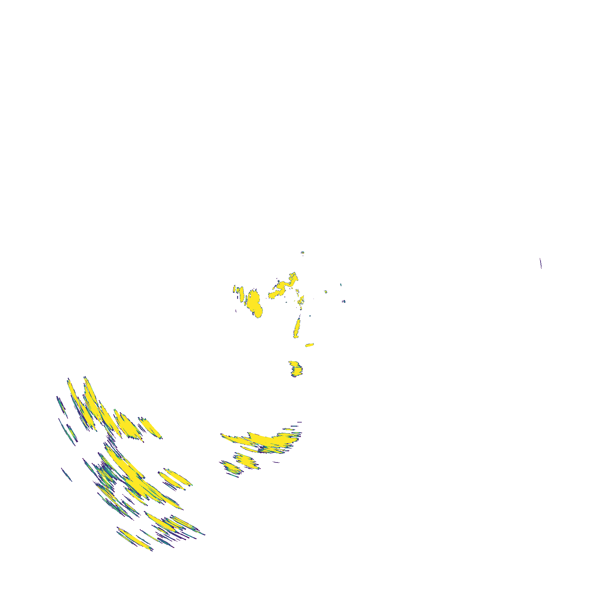
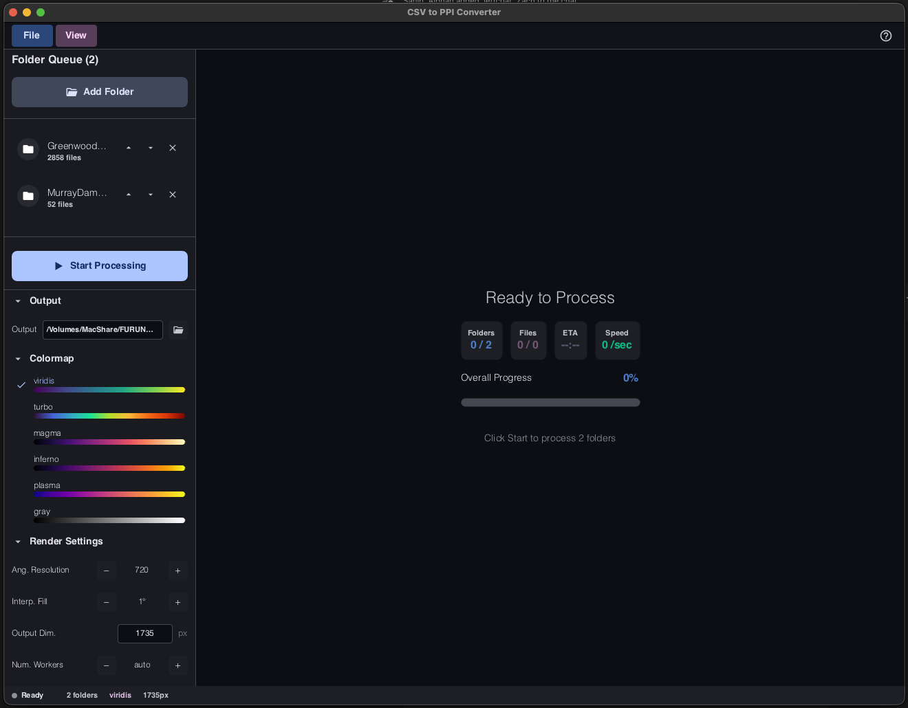
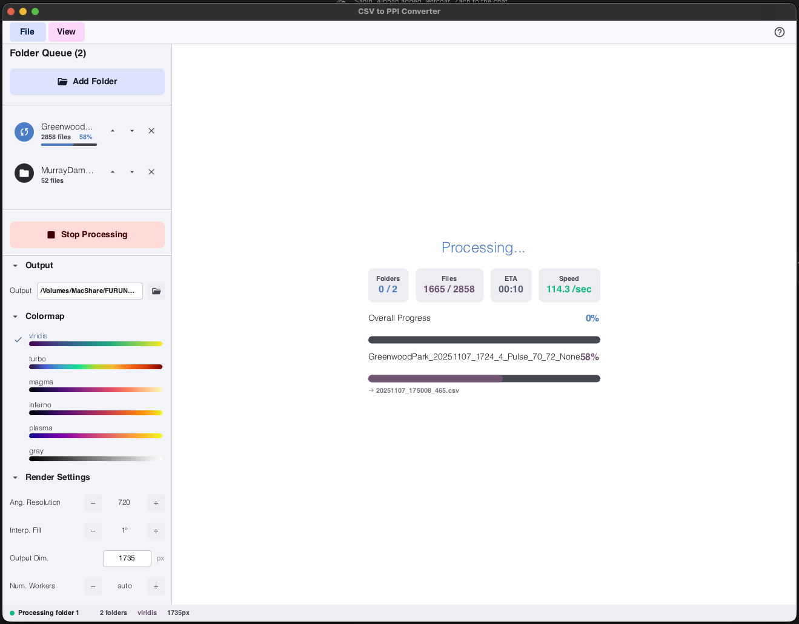
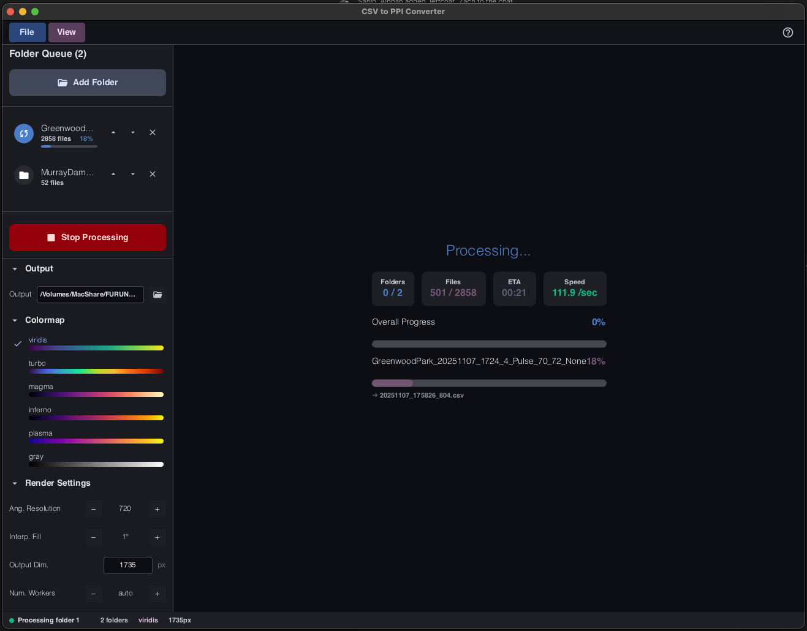
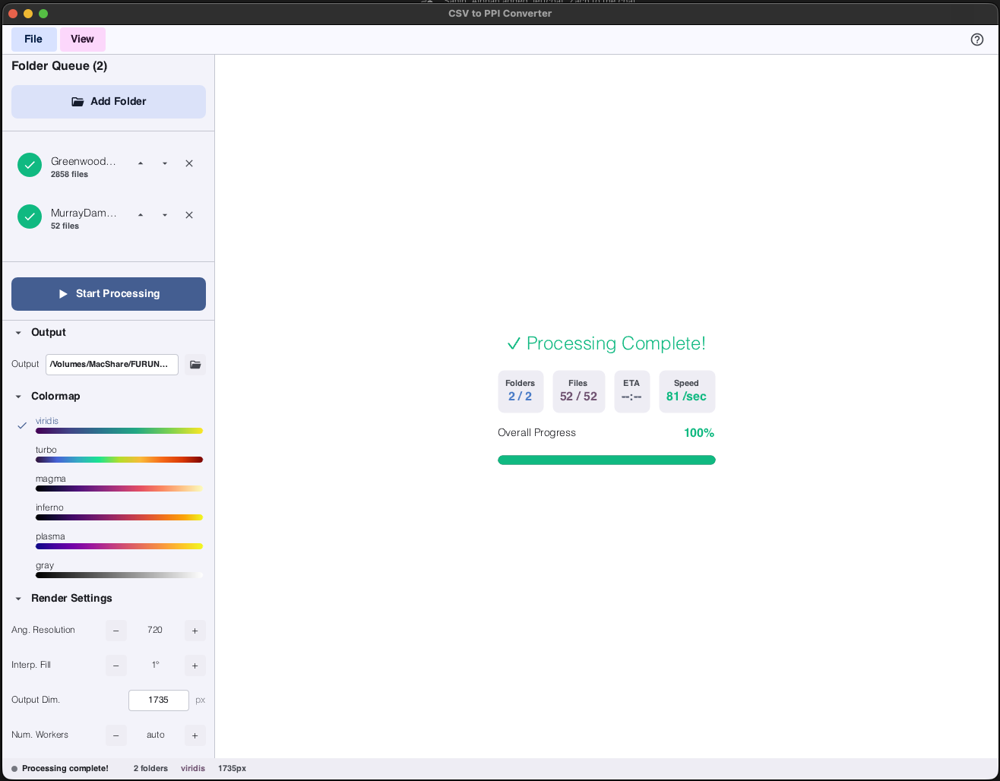
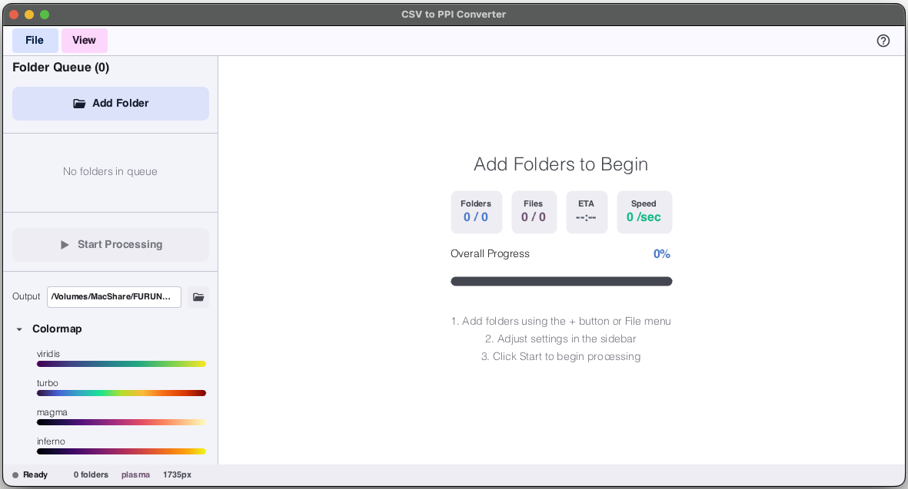
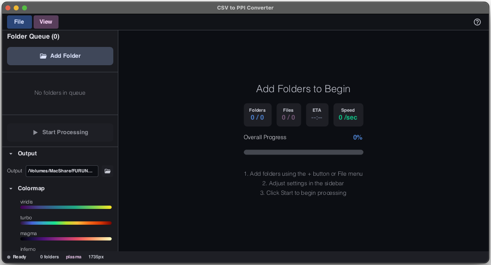

# CSV to PPI (Rust)

> **A high-performance GUI application for batch converting Furuno CSV radar captures to transparent PPI (Plan Position Indicator) images.**

Developed at the **[IMSEL Lab](https://github.com/IMSEL-Lab)** (Integrated Multiphysics and Systems Engineering Laboratory), Department of Mechanical Engineering, **University of South Carolina**.

Built with [Slint](https://slint.dev/) for a modern, responsive interface and powered by Rust for blazing-fast parallel processing.



---

## Features

- **Modern GUI** — Clean, intuitive interface with dark/light mode support
- **Batch Processing** — Queue multiple folders and process thousands of CSVs efficiently
- **Parallel Processing** — Multi-threaded rendering utilizing up to 90% of available CPU cores
- **Multiple Colormaps** — Viridis, Turbo, Magma, and Grayscale options
- **Real-time Progress** — Live progress bars, ETA, and files-per-second statistics
- **Persistent Settings** — Your preferences are saved between sessions
- **Transparent Output** — High-quality transparent PNGs with north at top

---

## Screenshots

### Initial State (Light Mode)
*Ready to add folders for processing*


### Ready to Process (Dark Mode)
*Folders queued and ready for batch conversion*



### Processing in Progress
*Real-time progress tracking with ETA and throughput statistics*

| Light Mode | Dark Mode |
|------------|-----------|
|  |  |

### Processing Complete
*Successfully converted all files in the queue*



### Compact View
*Responsive layout adapts to smaller window sizes*

| Light Mode | Dark Mode |
|------------|-----------|
|  |  |

---

## Quick Start

### macOS Installation

Download and mount `CSV_to_PPI.dmg`, then drag **CSV to PPI.app** to your Applications folder.

Alternatively, double-click `CSV to PPI.app` directly from the project directory to run.

### Build from Source

**Prerequisites**: Rust 1.70+

```bash
cd CSV_to_PPI_rust

# Build release version (much faster for batch processing)
cargo build --release

# Run the GUI
cargo run --release
```

### Cross-Platform Builds

This application is built with Slint, which supports Windows, Linux, and macOS. Pre-built binaries for Windows and Linux are available upon request — please open an issue or contact the maintainers.

---

## How to Use

1. **Add Folders** — Click "Add Folder" to queue directories containing CSV files
2. **Configure Settings** — Adjust processing parameters in the settings panel:
   - **Pulses**: Number of pulses per revolution (default: 720)
   - **Gap Threshold**: Max gap angle (degrees) to interpolate (default: 1.0)
   - **Image Size**: Output PNG dimensions (default: 1735px)
   - **Colormap**: Choose from viridis, turbo, magma, or gray
   - **Jobs**: Number of parallel threads (0 = auto, 90% of cores)
   - **Output Directory**: Custom output location (optional)
3. **Process** — Click "Start Processing" to begin batch conversion
4. **Monitor** — Watch real-time progress with ETA and throughput

---

## CSV Format

The application expects Furuno radar CSV format:

```csv
Status,Scale,Range,Gain,Angle,EchoValues
1,496,3,60,0,12,34,56,...
1,496,3,60,100,45,67,89,...
```

| Field | Description |
|-------|-------------|
| `Status` | Record status (usually `1`, ignored for rendering) |
| `Scale` | Raw scale factor from recorder (currently unused) |
| `Range` | Range setting for the sweep (integer) |
| `Gain` | Gain code for the sweep (integer) |
| `Angle` | Encoder ticks `[0, 8191]` converted to radians (0 = north, clockwise) |
| `EchoValues` | Comma-separated intensity values (0-255) for each range bin |

---

## Output

- **Format**: Transparent PNG
- **Orientation**: North at top, angles increasing clockwise
- **Scaling**: Pixel values normalized per-image by maximum echo value
- **Filename**: `<timestamp>_<gain>_<range>.png` (timestamp from CSV filename)

**Output Location**:
- If custom output directory is set: `<output_dir>/<folder_name>/`
- Otherwise: `<input_folder>/ppi_output/`

---

## Architecture

```
CSV_to_PPI_rust/
├── src/
│   ├── main.rs        # GUI entry point, callbacks, and state management
│   ├── processing.rs  # Core CSV to PPI rendering logic (parallel)
│   ├── queue.rs       # Folder queue management
│   └── config.rs      # Settings persistence
├── ui/
│   ├── appwindow.slint   # Main window layout
│   ├── app_theme.slint   # Theme definitions (dark/light)
│   └── components/       # Reusable UI components
├── figures/              # Documentation screenshots
└── Cargo.toml
```

### Processing Pipeline


1. **Parse CSV** — Extract angles, echo values, range, and gain metadata
2. **Regularize** — Resample raw pulses to fixed grid (configurable pulse count)
3. **Interpolate** — Fill small gaps (less than threshold) via linear interpolation
4. **Colormap** — Map normalized intensities to RGBA colors
5. **Render** — Convert polar data to Cartesian PPI image
6. **Save** — Write transparent PNG with metadata-based filename

---

## Configuration Options

| Option | CLI Flag | Default | Description |
|--------|----------|---------|-------------|
| Pulses | `-p, --pulses` | 720 | Pulses per revolution for resampling |
| Gap Threshold | `--gap-deg` | 1.0 | Max gap (degrees) to interpolate |
| Image Size | `--size` | 1735 | Output image dimensions (square) |
| Colormap | `--cmap` | viridis | Color scheme: viridis, turbo, magma, gray |
| Jobs | `-j, --jobs` | 0 | Thread count (0 = 90% of cores) |
| Output | `-o, --output` | — | Custom output directory |

---

## Dependencies

| Crate | Purpose |
|-------|---------|
| `slint` | Cross-platform GUI framework |
| `image` | PNG encoding and image manipulation |
| `colorous` | Scientific colormaps |
| `rayon` | Parallel iterator processing |
| `rfd` | Native file dialogs |
| `serde` + `serde_json` | Settings serialization |
| `anyhow` | Error handling |

---

## Acknowledgments

This project was developed at the **Integrated Multiphysics and Systems Engineering Laboratory (iMSEL)**, Department of Mechanical Engineering, University of South Carolina.

- Lab GitHub: [github.com/IMSEL-Lab](https://github.com/IMSEL-Lab)

---

## License

MIT License — See [LICENSE](LICENSE) for details.

---

## Contributing

Contributions welcome! Please open an issue or submit a PR.
